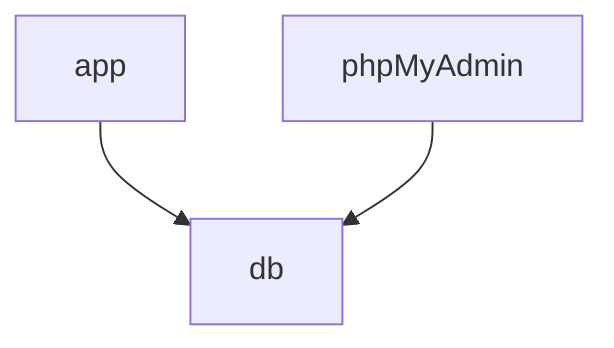

# Services du Mini-Chat

Ce document décrit les différents services qui composent l'application Mini-Chat.

## Vue d'ensemble des Services

### 1. Service Application (app)
- **Description** : Service principal de l'application de chat
- **Build** : Construction locale via Dockerfile
- **Port** : 8001
- **URL d'accès** : `http://localhost:8001`
- **Dépendances** : Service `db`
- **Variables d'environnement** :
  - MYSQL_HOST=db
  - MYSQL_USER=root
  - MYSQL_PASSWORD=admin123
  - DATABASE=mini_chat
- **Healthcheck** : Test HTTP toutes les 10 secondes

### 2. Service Base de Données (db)
- **Image** : MariaDB 10.11
- **Persistence** : Volume `db_data`
- **Configuration** :
  - Base de données : mini_chat
  - Scripts d'initialisation : dossier `db-init`
- **Volumes** :
  - `./db-init:/docker-entrypoint-initdb.d`
  - `db_data:/var/lib/mysql`
- **Healthcheck** : Test de connexion MySQL toutes les 10 secondes
- **Note** : Port 3306 non exposé à l'extérieur (sécurité)

### 3. Service phpMyAdmin
- **Image** : phpMyAdmin latest
- **Port** : 8002
- **URL d'accès** : `http://localhost:8002`
- **Dépendances** : Service `db`
- **Configuration** :
  - PMA_ARBITRARY=1
- **Healthcheck** : Test HTTP toutes les 10 secondes

## Réseau

Tous les services sont connectés via le réseau `mini_chat_net` (type: bridge)

## Volumes

- **db_data** : Volume persistant pour les données MariaDB

## Points d'accès

| Service     | URL                    | Usage                          |
|------------|------------------------|--------------------------------|
| App        | http://localhost:8001  | Application de chat            |
| phpMyAdmin | http://localhost:8002  | Administration base de données |

## Healthchecks

Tous les services sont configurés avec des healthchecks :
- Intervalle : 10 secondes
- Timeout : 5 secondes
- Tentatives : 5 fois

## Dépendances

## Notes de Sécurité

1. La base de données n'est pas exposée directement à l'extérieur
2. Les services communiquent via un réseau Docker isolé
3. Les healthchecks assurent la fiabilité des services